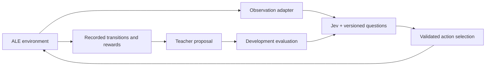

# Jev Atari Lab

**How should a teacher learn to improve the structured questions that control an Atari player?**

We have two goals: work toward mastering every single-agent Atari game exposed by the pinned
[Arcade Learning Environment](https://ale.farama.org/environments/) with
[TypeSafe Jev](https://typesafe.ai/), and discover effective **teacher-driven
optimizers for structured question policies**. We publish the evidence behind each attempt:
observations, model inputs and outputs, actions, rewards, videos, and every
teacher-authored change to the question program.

The central research question is which ways of selecting experience, assigning
credit, proposing edits, retaining candidates and using memory produce repeatable
improvements under a measured budget. Finding those optimization patterns is the
intended path to a paper. Initially both teacher and Jev weights stay fixed;
the question program changes. The full automatic optimizer remains proposed work.
All project research lives in [docs/](docs/README.md), including the
[optimizer design](docs/teacher-optimizer.md), [evaluation framework](docs/evaluation-framework.md)
and [research roadmap](docs/research-roadmap.md).

**Latest long trial:** On a fresh development seed, the unchanged v2 Jev question
reached the 20,000-frame cap at **7:18** (return -11), with the native match still
unfinished. Random, tracking, and interception controls finished at 2:21, 5:21,
and 3:21. See the [full report and video](docs/pong-match-feasibility-2026-09-18.md).
This is one development trajectory, not a solved-game or learning claim.

**Earlier short-run evidence:** On four development seeds with equal 2,000-frame horizons,
the vertical-control Jev question achieved -3 net reward, versus -14 for the literal
4px Python rule and -52 for the original Jev question. Jev matched the written rule
on only 66.85% of decisions. See the [controlled comparison](docs/pong-controls-2026-09-18.md).
This is a short-run result, not a solved-game or RL convergence claim.
The subsequent [no-FIRE wording experiment](docs/pong-no-fire-2026-09-18.md)
retains all six actions and reports the full follow-up, including a transport failure.

[Watch the latest Pong episode](docs/media/pong-match-v2-seed-56.mp4) ·
[Experiment journal](experiments/README.md) · [Game coverage](docs/games.md) ·
[Replay and audit guide](docs/replay.md)

## Two approaches, kept separate

| Track | What Jev predicts | Action selection | Current scope |
| --- | --- | --- | --- |
| **Direct policy** | One Choice question over available actions | Highest action probability | Pong objects; experimental raw RAM for other games |
| **Value-based** | Each action's first scoring outcome within 240 raw frames | `P(gain) - P(loss)`, then argmax | Pong with fixed heuristic continuation |

The videos use **direct policy**, not the 240-frame critic. The candidate question
explicitly describes vertical tracking, but Jev does not follow that rule exactly.
The videos do not show a strategy discovered from scratch. Action probabilities
are not Q values.

The value-based research asks whether experience can improve the questions used
to estimate consequences. A teacher proposes question changes; actual outcomes
and a held-out development gate decide whether they are retained. Jev weights stay
fixed. Multi-round automatic online learning and TD updates remain future work.



## Install

```bash
git clone https://github.com/memorysaver/jev-atari-lab.git
cd jev-atari-lab
git lfs install --local
git lfs pull
uv sync --locked --dev
```

Python 3.12 is required. Dependencies are pinned in `uv.lock`. Videos and reviewed
experiment archives use Git LFS; ROMs and credentials are never committed.

## Explore the Atari challenge

```bash
# Discover installed games without making API calls.
uv run jev-atari games

# Boot and exercise every registered game; this is not a gameplay benchmark.
uv run jev-atari games --check --out artifacts/environment-check.json

# Any registered game, using a local random policy.
uv run jev-atari arcade-play --game Breakout --policy random \
  --frames 2000 --video --out artifacts/breakout-random
```

The pinned installation registers **104** discrete single-agent `ALE/*-v5` games;
all passed a short local boot/action smoke test. "All Atari" means that versioned
scope, not every cartridge, mode, or multiplayer variant ever released.

The generic runner exposes 128 RAM bytes and recent history. Those bytes are **not
decoded objects**. It discovers legal joystick options from the environment and does
not assume `RIGHT` means physical rightward movement. Game-specific semantic
adapters, startup behavior, and useful policy questions still need validation.

## Run Jev

### API key setup

From the repository root, create a local `.env` from [`.env.example`](.env.example)
(preserving an existing `.env`):

```bash
[ -e .env ] || cp .env.example .env
chmod 600 .env
```

Open `.env` in your editor and set `TYPESAFE_API_KEY` to your TypeSafe key.
`OPENROUTER_API_KEY` is optional: leave it empty unless you use the OpenRouter
teacher through `--teacher-model`. `.env` is ignored by Git; keep `.env.example`
as an empty template and never put real keys in tracked files or command arguments.

The application reads environment variables; it does **not** automatically load
`.env`. The commands below explicitly load it with `uv run --env-file .env`.
If you already export the variables in your shell, omit `--env-file .env`.

**Shared credentials:** you can instead reuse
`~/.config/typesafe/credentials.env` across applications on this computer. Keep
its directory/file permissions at 700/600 and replace `--env-file .env` in the
commands below with `--env-file "$HOME/.config/typesafe/credentials.env"`.
There is no need to copy the key into the repository; each application must
explicitly load the shared file or receive the exported environment variables.

### Play with Jev

```bash
# Reproduce the Pong candidate with object observations.
uv run --env-file .env jev-atari play \
  --policy jev-action --program examples/vertical-policy-program.json \
  --model jev-1.13.0 --seed 27 --decisions 500 --max-api-calls 550 \
  --video --out artifacts/pong-direct

# Experimental transport, not a validated Breakout strategy.
uv run --env-file .env jev-atari arcade-play \
  --game Breakout --policy jev-action --model jev-1.13.0 \
  --frames 400 --max-api-calls 110 --video --out artifacts/breakout-jev
```

Every live command needs an HTTP-attempt budget including retries. API waits pause
the emulator. Videos use simulation time, not API wall time. Output directories
cannot be overwritten. Failures stay incomplete; Jev never silently falls back to a heuristic.

## Inspect and replay

Each decision records its observation, prediction, chosen action and resulting reward.
New CLI runs write `model-exchanges.jsonl` with request/response JSON bodies and
exchange IDs. Pong runs also write raw-frame RAM, RGB hashes and rewards.
One decision normally covers four raw frames; there are no invented model calls
for the other three frames.

```bash
# Restore the published archive, checking SHA-256 before extraction.
uv run python scripts/restore_experiments.py --out restored

# Re-execute recorded actions and verify observations/rewards; no API key needed.
uv run jev-atari replay \
  --episode restored/artifacts/policy-online-v1/development-candidate-resumed/seed-27 \
  --video --out artifacts/verified-seed-27
```

Early experiments predate raw API exchange logging. Their original predictions,
programs, trajectories and outcomes are preserved; missing provider bodies are
marked unavailable. Replay can reconstruct intermediate frames but cannot recreate
an original API response. See [the audit guide](docs/replay.md).

## Original value-learning experiment

```bash
uv run jev-atari collect --seeds 10 11 --split train --behavior heuristic \
  --roots-per-seed 16 --warmup 120 --stride 150 --horizon 240 --out artifacts/train
uv run jev-atari collect --seeds 16 17 --split development --behavior heuristic \
  --roots-per-seed 12 --warmup 120 --stride 150 --horizon 240 --out artifacts/development
uv run --env-file .env jev-atari learn \
  --train artifacts/train/dataset.json --development artifacts/development/dataset.json \
  --backend jev --model jev-1.13.0 --max-api-calls 90 \
  --proposals examples/first-event-proposals.json --out artifacts/value-round
```

That imported proposal is historical, not fresh learning from the new data. For a
new round, export a train-only `teacher-packet`, obtain a proposal, then evaluate it.
The optional `--teacher-model` adapter uses OpenRouter and a separate call budget.

The outcome labels are loss, no point, and gain. The 240 frames include the initial
four-frame action; subsequent actions follow a fixed tracking heuristic. This is
not a ball-position forecast for frame 240 and is not optimal Q*.

Seed suffixes 0-5 are training, 6-7 development, and 8-9 final test. Never generate
teacher feedback from final-test data. Offline prediction improvement does not
establish better online play. Keep rejected proposals and unsuccessful runs.

## Results and documentation

- [Native-match calibration](docs/pong-match-calibration-2026-09-18.md): local baselines, complete games versus frame caps, and the [next trial protocol](docs/pong-matches-protocol.md).
- [How Pong is evaluated](docs/pong-benchmark.md): full-match scores, short-run limits, and fair comparisons.

- [Fixed-frame Pong controls](docs/pong-controls-protocol.md): same-rule Python/Jev comparison, frozen seeds and shared API budget.
- [Controlled comparison results](docs/pong-controls-2026-09-18.md): all 16 episodes, rule adherence, costs and replayable evidence.
- [Pong policy pilot](docs/policy-online-2026-09-18.md): seeds, stopping rules, costs and limitations.
- [Value prediction pilot](docs/pilot-2026-09-18.md): better Brier score, rejected due to MAE regression.
- [Score versus Choice](docs/choice-ablation-2026-09-18.md): offline question-form comparison.
- [Observation contract](docs/observation.md) and [Pong protocol](docs/protocol.md).
- [Game coverage](docs/games.md), [research direction](docs/research-direction.md),
  and [third-party attribution](THIRD_PARTY_NOTICES.md).

## License and citation

Copyright (c) 2026 Ming-Cheng Ho (memorysaver).

The project's original software, structured-question programs, and accompanying
documentation are licensed under the **GNU General Public License version 2 only**
(`GPL-2.0-only`). See [LICENSE](LICENSE). Dependencies retain their own licenses;
the OCAtari attribution and main runtime dependency licenses are documented in
[THIRD_PARTY_NOTICES.md](THIRD_PARTY_NOTICES.md).

This license does not grant rights to third-party Atari ROMs, game artwork or
audio appearing in recordings, or the Jev service and model. Historical experiment
archives remain unchanged so their published checksums and provenance stay valid.

If you use this project in research, please cite it using [CITATION.cff](CITATION.cff)
or GitHub's **Cite this repository** button. Cite the exact commit or release used
for your experiments. This is a citation request, not an additional license term.
There is no associated paper or DOI yet; a future paper can be added as the
preferred citation and have its own publication license.

## Development

```bash
uv run pytest
uv run ruff check .
uv run ruff format --check .
```

Tests use local emulators and mocked HTTP, never live model calls. Working artifacts
stay in ignored `artifacts/`; reviewed releases live in `experiments/`. All tracked
documentation, prompts, comments and commit messages are in English.
