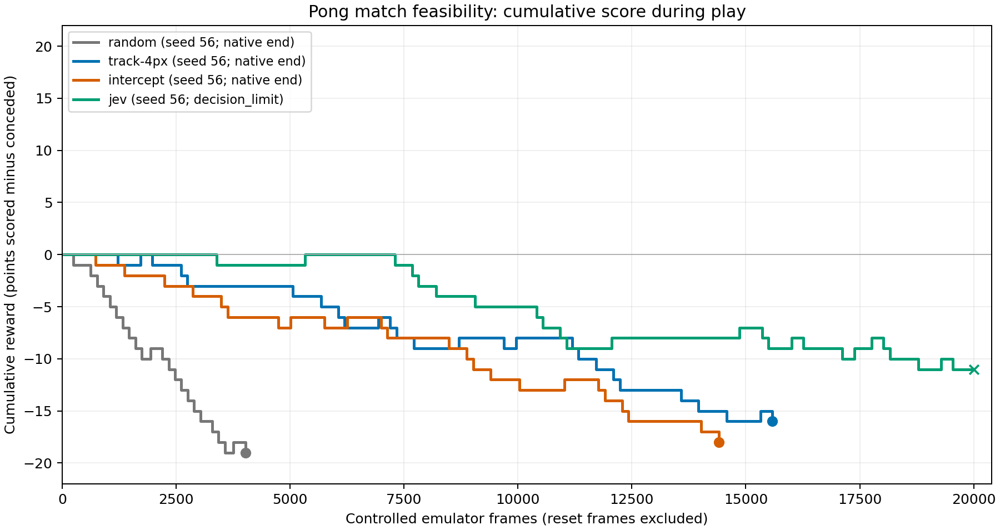

# First long Jev Pong match attempt — 2026-09-18

The unchanged v2 Jev question reached the **20,000-frame cap** at **7:18**
(return **-11**) on development seed 56. The native match remained unfinished.
This supports bounded control performance, not a completed match, win, draw, or teacher-learning claim.

## Frozen design

The [protocol](pong-matches-protocol.md) and implementation were committed as
`01db8052fc7b6d9d0aca40a808a9cdca444af7a3` before this run. After
[training-only local calibration](pong-match-calibration-2026-09-18.md), the trial
used a fresh development seed (56), one realization per arm, a 20,000-frame cap,
and a shared limit of 5,500 HTTP attempts. It stopped at native termination or the
cap, with no point cutoff, invented terminal tail, teacher change, or fallback.

The program was the unchanged `pong-vertical-control-v2` question, hash
`2ef87250f491fcd5a2ba72f29e3f03b6bc66c4ab7315e9e724df76352326633d`, using
`jev-1.13.0`. The no-FIRE v3 wording was not promoted or tested here. All arms used
the same RAM objects, six ALE actions, hold=4, sticky=0.25, reset NOOPs=0..30,
mode=0, difficulty=0. Jev chose via validated probability argmax. The local
interception controller did not preprocess the state or override Jev's choices.

## Every policy on seed 56

| Policy | Agent:opponent | Observed return | Controlled frames | Outcome |
| --- | ---: | ---: | ---: | --- |
| random | 2:21 | -19 | 4,021 | loss |
| track-4px | 5:21 | -16 | 15,584 | loss |
| intercept | 3:21 | -18 | 14,408 | loss |
| jev | 7:18 | -11 | 20,000 | Unfinished (decision_limit) |

Observed returns from API/error prefixes are descriptive only; the machine-readable
results use null for their completed protocol score. Frame-capped returns are valid
for the predeclared capped protocol, but not native-match wins or draws. No result
here is an independent final test or a multi-seed population estimate.



Curves stop at their last actual frame. Circles mark native termination; crosses
mark a frame cap or interruption. The x-axis excludes reset frames. This is score
progress during play, not a learning curve across training rounds.

## What the short clip would have shown

These checkpoints describe the same single Jev trajectory, without resampling.

| Controlled frame | Agent:opponent |
| --- | ---: |
| 2,000 | 0:0 |
| 4,000 | 0:1 |
| 6,000 | 1:1 |
| 8,000 | 1:4 |
| 10,000 | 1:6 |
| 12,000 | 1:10 |
| 14,000 | 2:10 |
| 16,000 | 3:12 |
| 18,000 | 6:14 |
| 20,000 | 7:18 |

The first 2,000 frames ended before this trajectory's first scored point. A short
zero-return clip therefore would not reveal the later outcome. This is why
[benchmark interpretation](pong-benchmark.md) separates short-run return from
complete-match performance. It does not make a universal claim from one seed.

## Behavior and costs

The Jev trajectory contains **5,000 decisions**, with action counts
`{"0": 3180, "2": 907, "3": 913}` (IDs 0=NOOP, 2=RIGHT/up, 3=LEFT/down;
all six options were available). Mean confidence was **0.5664**,
and **2,204** decisions had confidence below 0.5.
Literal 4px rule agreement was **65.32%**.
These are diagnostics on visited states, not measures of correctness or win probability.
The [trace analysis](../experiments/pong-match-feasibility-v1-trace-analysis.json)
preserves every scoring event, checkpoint and control diagnostic.

The run used **5,000 / 5,500 HTTP attempts**, with status counts
`{"200": 5000}`. Successful responses reported
**8,430,279 input tokens** and **343,180 output tokens**. Summed HTTP time was **1326.797 seconds**, versus
**333.333 simulated seconds** for Jev's recorded gameplay.
All 5,000 requests returned HTTP 200, with no retries or transport failures.
Provider billing was not queried. The three local baselines and all verification
runs made no model requests.

## Preserved evidence

[Watch the Jev episode](media/pong-match-v2-seed-56.mp4).
The [results](../experiments/pong-match-feasibility-v1-results.json),
[plan](../experiments/pong-match-feasibility-v1-plan.json), and
[audit](../experiments/pong-match-feasibility-v1-audit.json) are readable indexes.
The [LFS archive](../experiments/pong-match-feasibility-v1-2026-09-18.tar.gz) and
[manifest](../experiments/pong-match-feasibility-v1-2026-09-18.manifest.json)
include all four videos, original frames and decisions, every model exchange,
ledgers, exact question, trace analysis and replay verification.

All recorded episodes passed emulator replay with matching observations, rewards,
and raw RAM/RGB hashes. The audit recomputed local-policy actions, native-match
classification and aggregate denominators, and checked original Jev request bodies,
returned models, decoded actions, retry state and global ledgers. Auditing uses no API.

```bash
git lfs pull
uv run python scripts/restore_experiments.py \
  --manifest experiments/pong-match-feasibility-v1-2026-09-18.manifest.json \
  --out restored-match-feasibility
uv run python scripts/verify_matches.py \
  --run restored-match-feasibility/pong-match-feasibility-v1 \
  --out artifacts/match-feasibility-audit
```

The figure can be regenerated with the optional plotting dependency (the game
runtime does not depend on matplotlib):

```bash
uv run --with matplotlib==3.10.7 python scripts/plot_matches.py \
  --run restored-match-feasibility/pong-match-feasibility-v1 \
  --out artifacts/match-scores.png
```

## What remains unproven

A single development trajectory cannot establish a stable policy advantage, a
reliable full-match win rate, sample efficiency, or experience-driven learning.
The question and model were frozen throughout. A teacher-learning study still needs
isolated training feedback, multiple controlled revisions, fresh evaluation seeds,
and an equal-budget control without experience feedback. The value-based question
track remains separate from this direct-policy feasibility test.
