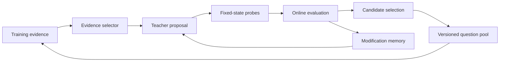

# Teacher-driven question optimizer

Status: proposed research design, 2026-09-18. Existing logging, imported proposals,
limited selection gates and replay are building blocks. The complete optimizer
and pattern-discovery process below are not implemented or validated.

## What the optimizer controls

The teacher is a proposal engine inside an optimizer. Initially fix its model and
weights, Jev's version and weights, observation adapter, legal actions, reward,
control frequency and decoder. Optimize the external question definition. A later
teacher-model comparison must hold the optimizer and resources fixed.

Write one update as:

`proposal = teacher(current_question, training_evidence, modification_memory)`

`next_pool = selector(current_pool, proposal, measured_evaluations, remaining_budget)`

The teacher's explanation is a hypothesis. The selector's scores come from executed
experiments. A confident reflection is not an observed counterfactual outcome.

There are two levels of optimization. Within a run, the optimizer searches over
question programs. Across controlled studies, we compare optimizer designs under
the same resource budget. A promising pattern can inform the next optimizer
version, whose advantage must then be tested on fresh evidence. This second level
is the project's central scientific objective; it is not yet an implemented
automatic optimizer-of-optimizers.

| Component | Research variable | Keep observable |
| --- | --- | --- |
| Evidence selection | Representative states, failure windows, uncertainty, novelty | Inclusion rule, split, sampling weights, evidence IDs |
| Credit assignment | Episode feedback, local traces, controlled action branches | Horizon, continuation policy, randomness, censoring and costs |
| Proposal operator | Clarify, replace a condition, change a threshold, add an example | Exact diff, targeted component, parent and predicted effect |
| Search/selection | Greedy, candidate pool, instance-wise Pareto selection | Per-case scores, rejected candidates, selection rule |
| Memory | Accepted/rejected edits and their contexts | Supported conditions, regressions, contradictory evidence |
| Budget allocation | State probes versus online validation versus replication | Teacher/Jev attempts, tokens, environment frames and wall time |

## Start with a constrained question representation

The first learning study edits one `guidance` string used by one action Choice
question. Keep its length limit and all six Pong action criteria unchanged. For
human review, identify sections within that string:

- Objective wording, always aligned with the fixed environment reward.
- Interpretation of visible state, coordinates, missing objects and history.
- Action decision rule, including the action's duration.
- Behavior under uncertainty or missing evidence.

These are proposed editing boundaries, not new API fields or a multi-question
runtime. Change one component per initial proposal so its intended effect can be
traced. Numeric edits, such as a deadband change, and semantic edits, such as using
approach direction, should be recorded separately.

Later compare richer representations: multiple questions, rubrics, applicable
conditions, verified examples and retrieval. Each requires an explicit execution
contract. Questions evaluated independently cannot be assumed to consume each
other's answers; sequential dependencies add calls and must be measured.

## A proposed optimization round

1. Freeze the incumbent question, model versions, contracts, splits and remaining
   budgets. Record the optimizer configuration and its source revision.
2. Collect or select training experience under a declared sampling rule. Include
   successes and representative ordinary states as well as failures. Do not expose
   development trajectories or final-test data to the teacher.
3. Ask the isolated teacher for a bounded proposal with evidence references,
   a hypothesis, exact patch, expected action changes and possible regressions.
4. Validate the proposal's schema, allowed fields, evidence lineage and size.
   Use fixed-state probes to measure its behavioral effect and old-versus-old noise.
   Probe scores do not replace an online return test.
5. Evaluate eligible candidates with the frozen online protocol. Compare per-seed
   outcomes and costs; handle unfinished and failed runs explicitly. Apply the
   predeclared selection rule without changing it after seeing scores.
6. Preserve the incumbent, every candidate, all evaluation outcomes, the selection
   decision and rejected edits. Update modification memory with observed limits.

A proposed minimum pilot has three rounds with one candidate each. Its purpose is
to validate the loop; it cannot establish a stable optimizer advantage. Exact seeds,
frame caps, teacher/Jev budgets, repetition counts and acceptance thresholds must
be frozen in a dedicated run protocol before any paid experiment. Earlier budget
sketches are not current authorization or a default experiment configuration.

## Proposed round record

The following is a documentation contract to implement, not a claim about existing
artifact fields. References point to immutable evidence rather than embedding keys
or private context.

| Record group | Required contents |
| --- | --- |
| Identity | Experiment/round/candidate IDs; parent IDs; source, question and optimizer hashes |
| Teacher context | Actual teacher model, context/packet hash, allowed evidence IDs, split and sampling rule |
| Change | Component, operator, before/after text, hypothesis, predicted behavioral effect, regression risks |
| Evaluation | Probe IDs, old/new repeats, full per-episode returns, completion/censoring, uncertainty, costs |
| Decision | Frozen gate ID, accepted/rejected/inconclusive status and measured reason |
| Memory | Applicable conditions, contrary cases, links to subsequent replication or rollback |

An infrastructure failure is not a bad-policy score. An edit with no detected
action changes is not proven inert on every state. Rejection under one budget or
case set does not establish universal failure. Preserve those distinctions.

## Discovering optimization patterns

A pattern is a reusable, testable relationship between an edit, a situation and
its measured effect. For example: "making the four-frame action effect explicit
changes decisions in overshoot situations and improves return under these settings."
This is an illustrative hypothesis, not a finding.

Before confirmatory evaluation, define edit categories and situation labels using
training evidence. Record a matrix of **operator × situation × round × independent
run**, linked to action changes, return differences, regressions and cost. Include
unsuccessful edits and proposals that never reach the online gate. If only screened
candidates receive rollouts, mark that selection and leave unmeasured effects unknown.

Use three evidence levels:

1. **Exploratory association:** an edit and an improvement occurred together.
2. **Replicated pattern:** the prespecified relationship repeats on fresh seeds and
   independent optimizer runs, with an estimated effect and uncertainty.
3. **Controlled mechanism evidence:** a matched ablation or randomized comparison
   isolates the edit/operator while holding other factors fixed.

A teacher narrative cannot promote itself through these levels. Account for prompt
interactions and multiple candidate searches; discover categories on training runs,
then confirm them on separate evidence. Cross-game reuse needs a held-out game
protocol, including whether adapters or teacher instructions already contain game knowledge.

## Relationship to the value-based track

Observed future return identifies an outcome, not which preceding action caused it.
For local action-value evidence, define the horizon, discount time unit and fixed
continuation policy. Heuristic continuation measures that heuristic's consequences;
it does not estimate Jev continuation value automatically. Identical snapshot/RNG
replays are reproducibility checks, not independent samples.

A later TD experiment needs comparable value targets, a frozen target question
version, terminal handling and online validation. Maximizing noisy branch estimates
can bias the selected value upward. These are separate mechanisms to test after the
initial policy optimizer; no Q-learning convergence claim follows from text updates.
